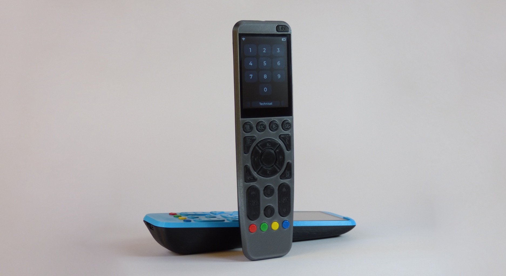

# OMOTE - Open Universal Remote - Hardware

## Overview

OMOTE is an ESP32-based open-source universal remote. Its capacitive 2.8” touchscreen provides an intuitive and snappy user interface for switching devices and settings. No hub or docking station is required as the remote features infrared, Wi-Fi and Bluetooth connectivity. With its well-optimized power consumption, OMOTE can run for months on a charge. And since the design files are open source, you can fully customize them to your devices and needs.

  

### Features
* 2.8” 320x240px capacitive touchscreen
* Ergonomic, fully 3D-printed case
* Built in infrared, Wi-Fi and Bluetooth
* Press any button or simply lift the remote to wake it up
* Up to 6 months of battery life using a 2000 mAh Li-Po battery

### The state of this project

The hardware for OMOTE is designed to be easily replicated, using 3D-printed parts, a 2-layer PCB and commonly available components. The mechanical and PCB design can be considered mostly complete. Still, there might be areas for improvement, for example the IR range could be further optimized.

### Building the hardware

The central component of OMOTE is its PCB. If you want to build the PCB yourself, you will need SMT-reflow tools like a hot plate or a hot-air station. The 2-layered board and a solder paste stencil can be ordered from any PCB manufacturer using the [KiCad files](https://github.com/OMOTE-Community/OMOTE-Hardware/tree/main/PCB). Manufacturers like OSHPARK or Aisler will accept these files directly. For JLCPCB or PCBWay, you can use their plugins to export the optimized Gerber files. A [zip archive](https://github.com/OMOTE-Community/OMOTE-Hardware/blob/main/PCB/production/gerber.zip) with theses Gerber files is also included in this repository. You can also choose to order assembled PCBs from JLCPCB using the [instructions](https://github.com/OMOTE-Community/OMOTE-Hardware/wiki/How-to-order-assembled-PCBs) in the Wiki.

The electrical components can be sourced from LCSC, but most of them should be available from the usual suppliers like Digikey or Mouser as well. You can check out the [BOM](https://github.com/OMOTE-Community/OMOTE-Hardware/blob/main/PCB/BOM.csv) for all the necessary components.

The project uses a 2000mAh Li-Ion battery with a JST-PHR-2 connector. Any 3.7V Li-Ion battery that fits into the 50x34x10mm dimensions should work all right. From rev 4 on, the board includes battery protection features against overcurrent and undervoltage. It cannot hurt to use a battery with integrated protection anyway (usually visible as a small PCB under Kapton tape between the battery cables).

The 2.8" capacitive touchscreen can be sourced from Adafruit ([2770](https://www.adafruit.com/product/2770)). If you look for the part number CH280QV10-CT, you can also buy this display directly from the manufacturer via [Alibaba](https://www.alibaba.com/product-detail/High-Quality-240-3-rgb-320_1600408828330.html). Shipping from China is expensive, so this only makes sense if you order multiple displays. In general, the cost for a single OMOTE is quite high. Please join the [Discord server](https://discord.gg/5PnYFAsKsG) and then check out the [buy-sell page](https://discord.com/channels/1138116475559882852/1153343867681243279) to see if you can share the cost of the PCBs and components with others.

  

The [housing and buttons](https://github.com/OMOTE-Community/OMOTE-Hardware/tree/main/CAD) can be printed using PLA or PETG. The parts from the project photos were sliced with PrusaSlicer with a layer height of 0.25mm and printed using ColorFabb PETG. It is important that the case part is printed with its flat side towards the print bed using lots of support structures. If your printer is well calibrated, the cover plate will snap onto the case.

### Firmware
Firmware is available at [OMOTE ESP32 Firmware](https://github.com/OMOTE-Community/OMOTE-Firmware/) and [OMOTE ESP32 Firmware object-oriented](https://github.com/OMOTE-Community/OMOTE-Firmware-object-oriented). See this [comparison of the firmwares](https://github.com/OMOTE-Community/.github/blob/main/profile/firmware-comparison.md).

## Contributing

If you have a suggestion for an improvement, please fork the repo and create a pull request. You can also simply open an issue, or for more general feature requests, head over to the [discussions](https://github.com/OMOTE-Community/OMOTE-Hardware/discussions).

## License

Distributed under the GPL v3 License. See [LICENSE](https://github.com/OMOTE-Community/OMOTE-Hardware/blob/main/LICENSE) for more information.

## Contact

[][link1]

Join the OMOTE Discord: [https://discord.gg/5PnYFAsKsG](https://discord.gg/5PnYFAsKsG)

Maximilian Kern - [kernm.de](https://kernm.de)

Project Page on Hackaday.io: [https://hackaday.io/project/191752-omote-diy-universal-remote](https://hackaday.io/project/191752-omote-diy-universal-remote)

[link1]: https://discord.gg/5PnYFAsKsG
